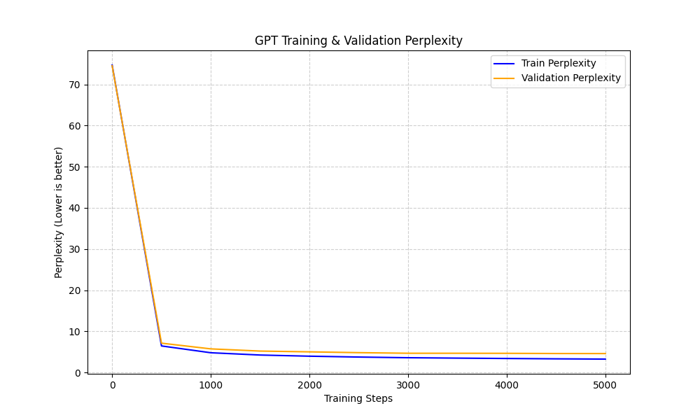

# Custom GPT-Style Transformer from Scratch

An autoregressive language model built entirely from scratch in PyTorch. While the foundation of this project is heavily inspired by Andrej Karpathy's "Let's build GPT" tutorial, this architecture goes significantly further by implementing modern, production-grade scaling features from scratch, specifically **Grouped Query Attention (GQA)** and **KV-Caching**. 

The model is trained on the TinyShakespeare dataset and features a modularized, production-style training and inference pipeline designed to run efficiently within a 4GB VRAM constraint (NVIDIA RTX 3050).

## 🧠 Architecture Highlights

Unlike standard educational implementations that use vanilla Multi-Head Attention, this model uses Grouped Query Attention calculated purely via matrix multiplication (no `F.scaled_dot_product` shortcuts). During autoregressive generation, a custom KV-Cache handles sequence history to optimize memory usage and token generation speed.

| Parameter | Configuration |
| :--- | :--- |
| **Total Parameters** | 11.7M |
| **Layers (Blocks)** | 4 |
| **Attention Heads** | 12 |
| **KV Heads (GQA)** | 6 |
| **Embedding Dimension** | 512 |
| **Context Length** | 256 |
| **Vocabulary Size** | 65 (Character-Level) |

## 📊 Training & Performance

The model was trained for 5,000 iterations utilizing an AdamW optimizer, mixed precision (`torch.cuda.amp`), and a cosine learning rate schedule with warmup.

* **Final Train Loss:** 1.1776 (Perplexity: 3.24)
* **Final Validation Loss:** 1.5246 (Perplexity: 4.59)

Below are the training and validation perplexity curves charting the model's convergence:



### 💾 4GB VRAM Optimization Strategies

To squeeze this model comfortably into a strict **4GB VRAM limit** (like an RTX 3050), the codebase relies on a combination of hardware-level efficiencies and structural design choices:

* **Automatic Mixed Precision (AMP):** Dynamically checks for CUDA availability and utilizes `torch.cuda.amp.GradScaler`. Running forward and backward passes in 16-bit precision cuts activation and gradient memory overhead exactly in half.
* **Micro-Vocabulary Scaling:** By using a character-level tokenizer, the vocabulary stays at just ~65 tokens. This prevents the final linear projection layer (`self.proj = nn.Linear(model_dim, vocab_size)`) from blowing up into a massive memory bottleneck.
* **Balanced Hyperparameters:** Training with a batch size of 64 paired with a compact context window (256 tokens) keeps the operational footprint small.
* **Structural Efficiency:** Grouped Query Attention (GQA) and custom KV-Caching serve as the primary foundational memory savers during generation.

## 🗣️ Sample Generation

Because this model uses a character-level tokenizer, it must spend computational capacity learning how to compose letters into words before it can understand sentence structure. The generation exhibits exact expected behavior for a small character-level model: it achieves strong **local coherence** (spelling completely valid English words and formatting Shakespearean scripts correctly) but struggles with **global coherence** (sentences do not logically connect).

Additionally, generation utilizes **Top-K sampling** (preventing infinite probability loops common in greedy decoding) with temperature scaling. 

**Prompt:** `To be, or not to be, that is the question:`
> **Generated output:**
> 
> To be, or not to be, that is the question:  
> Where is the senate, the mayor ne'er shall have  
> And come to your princely brother.
> 
> CORIOLANUS: Well, that's a banishment in a word. 
> 
> BUCKINGHAM: More than shall be well. 
> 
> BUSHY:Nay, but the lords o

> ⚠️ **Note on Generation Cutoffs:** You may notice the model occasionally ends abruptly mid-word or mid-sentence (e.g., `the lords o`). This is expected behavior. Because this is a character-level model running on a strict token budget (`max_new_tokens`), the generation loop terminates exactly when the character count is reached, regardless of punctuation.

## 🛠️ Challenges & Debugging

Building a neural network from the ground up involved solving severe silent bugs:
1.  **The Dropout Mask Bug:** Initially, `torch.manual_seed(0)` was accidentally left inside the forward pass. This caused the Dropout layer to generate the *exact same mask* on every forward pass, permanently killing the same 20% of neurons instead of randomly dropping them.
2.  **KVCache Destruction:** During early inference testing, the KVCache was initialized *inside* the model's forward pass. This meant the cache was destroyed and re-instantiated as empty upon every single token generation, discarding the model's history. Moving cache initialization to the outer generation loop resolved the O(N^2) compute overhead.
3.  **Positional Encoding Overflow:** To prevent out-of-bounds positional embeddings during generation when using the KV-cache, I implemented a sliding window to keep positions within `[0, context_length - 1]`, aligning the sequence to the end of the context window.

## 🚀 How to Run

**1. Training**  
To train the model from scratch and generate new loss curves, execute the run script. This will output a `gpt_checkpoint.pth` file in the `results/` folder.
```bash
python scripts/run.py
```  
**2. Inference**  
To generate text using the pretrained weights, point the inference script to the checkpoint. You can tweak the temperature and the number of tokens generated.
```bash
python scripts/infer.py --checkpoint results/gpt_checkpoint.pth --temperature 0.8 --tokens 200 --top_k 10
```

## 🗺️ Next Steps

* **Byte-Pair Encoding (BPE):** Integrating the `tiktoken` library to replace the character-level tokenizer. By eliminating the need for the model to learn character composition, the same parameter count should yield drastically higher global semantic coherence. (Note: A custom BPE merge algorithm implementation is available in `scripts/custom_bpe.py`)
* **Mechanistic Interpretability:** Implementing Activation Patching and Logit Lenses on scaled-down subsets of this architecture to reverse-engineer information flow and discover specific circuit diagrams.
